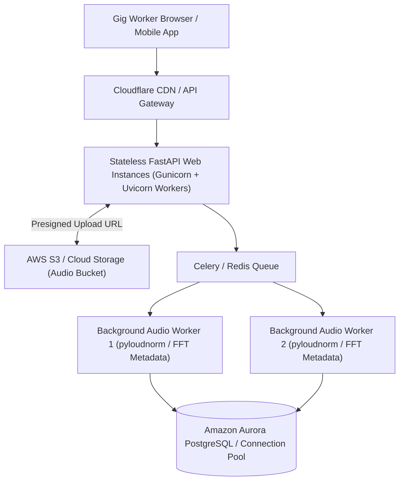

# ConsultBae AI Automation Take-Home Assignment

[](https://www.python.org/)
[](https://fastapi.tiangolo.com/)
[](https://www.sqlite.org/)
[](https://n8n.io/)

A complete, production-grade implementation of the **ConsultBae AI Automation Take-Home Assignment** covering multi-source data ingestion, deterministic entity resolution, n8n workflow automation, and an interactive audio collection web application with EBU R128 integrated loudness metadata extraction.

---

## 📋 Table of Contents

1. [Project Overview & Architecture](#-project-overview--architecture)
2. [Quickstart & Setup Instructions](#-quickstart--setup-instructions)
3. [Task 1 & Phase 2: Multi-Source Data Integration & Entity Resolution](#-task-1--phase-2-multi-source-data-integration--entity-resolution)
4. [Task 2: n8n Workflow Automation](#-task-2-n8n-workflow-automation)
5. [Task 3: Audio Collection & Metadata Analytics Web App](#-task-3-audio-collection--metadata-analytics-web-app)
6. [Task 4: Comprehensive Data Issues Report](#-task-4-comprehensive-data-issues-report)
7. [Stuck Log (Hardest Engineering Challenges & Decisions)](#-stuck-log-hardest-engineering-challenges--decisions)
8. [Task 5 (Stretch): 5,000 Worker Scale Architecture Analysis](#-task-5-stretch-5000-worker-scale-architecture-analysis)

---

## 🏗 Project Overview & Architecture

```
consultbae-ai-automation-assignment/
│
├── data/                                # Raw immutable source datasets
│   ├── source1_naukri_applicants.csv
│   ├── source2_gig_workers.csv
│   └── source3_cbnexus_contacts.csv
│
├── processed/                           # Normalized cleaned datasets & audit log
│   ├── cleaned_naukri_applicants.csv
│   ├── cleaned_gig_workers.csv
│   ├── cleaned_cbnexus_contacts.csv
│   └── data_quality_audit_log.csv
│
├── database/                            # SQLite Relational Store
│   └── consultbae.db                    # Contains PERSONS, SOURCE_RECORDS, AUDIO_SUBMISSIONS
│
├── scripts/                             # Automation & pipeline execution scripts
│   ├── normalize_data.py                # Phase 1B Ingestion & Normalization
│   ├── entity_matching.py               # Phase 2 Disjoint Set Union (DSU) Matching
│   ├── inspect_database.py              # Verification & Diagnostic tool
│   ├── init_audio_db.py                 # AUDIO_SUBMISSIONS schema setup
│   └── run_app.py                       # Task 3 Web Application Launcher
│
├── app/                                 # Task 3 FastAPI Web Application
│   ├── main.py                          # REST API & Metadata Calculation Engine
│   ├── static/                          # Single Page Web Portal (HTML/CSS/JS)
│   └── __init__.py
│
├── uploads/                             # Physical storage directory for raw audio files
│   └── .gitkeep
│
├── n8n/                                 # Task 2 Workflow Automations
│   └── candidate_automation_workflow.json
│
├── README.md                            # Comprehensive Documentation, Setup & Reports
└── .gitignore
```

---

## ⚡ Quickstart & Setup Instructions

### Prerequisites
- **Python 3.10+**
- **Node.js v18+ / npm** (for running local n8n)

### 1. Environment Setup & Dependency Installation
```bash
# Clone repository
git clone https://github.com/InquistiveSantu/consultbae-ai-automation-assignment.git
cd consultbae-ai-automation-assignment

# Install Python dependencies
pip install fastapi uvicorn python-multipart pydub soundfile pyloudnorm scipy numpy audioop-lts httpx
```

### 2. Run Data Pipeline (Task 1 & Phase 2)
```bash
# Phase 1B: Ingest raw CSVs and generate normalized datasets
python scripts/normalize_data.py

# Phase 2: Execute DSU entity resolution & build SQLite database
python scripts/entity_matching.py

# Inspect database schema and resolved entities
python scripts/inspect_database.py
```

### 3. Launch Task 3 Audio Collection Web Portal
```bash
# Start FastAPI Web Application server
python scripts/run_app.py
```
- **Web Portal URL**: [http://localhost:8000](http://localhost:8000)
- **Interactive OpenAPI Specs**: [http://localhost:8000/docs](http://localhost:8000/docs)

### 4. Run Task 2 n8n Workflow Automation
```bash
# Start local n8n server
npx n8n start
```
- Open `http://localhost:5678` in your browser.
- Select **`...` (Top-Right Menu) $\rightarrow$ Import from File**.
- Select `n8n/candidate_automation_workflow.json`.

---

## 🧬 Task 1 & Phase 2: Multi-Source Data Integration & Entity Resolution

### Schema Architecture (`database/consultbae.db`)

#### `PERSONS` Table (Canonical Golden Entities)
Stores unified person profiles created via deterministic Disjoint Set Union (DSU) graph clustering.
- Total Golden Entities Resolved: **60 Golden Persons**
- Persons linked across multiple source files: **27 entities**
- Ambiguous pairs flagged for manual review: **5 pairs (10 records)**

#### `SOURCE_RECORDS` Table (Full Lineage Audit Trail)
Preserves all 102 source record entries across Naukri, Gig Workers, and CBNexus with raw JSON payloads, normalized JSON payloads, and exact match rules.

### Key Resolved Edge Cases
- **Deepak Nair**: Correctly split into **2 distinct persons** (`PER_025` in Bengaluru with 3-way match, `PER_054` in Delhi NCR).
- **Arjun Mehta**: Resolved into **3 distinct person profiles** (`PER_012` for Arjun Mehta #1, `PER_041` & `PER_056` flagged for manual review).
- **Nikhil Chopra**: Merged intra-source alternate emails (`alt.nikhil.chopra70@example.com`) into single profile `PER_019`.
- **Rohit Verma**: Merged `R. Verma` (Line 25) with `Rohit Verma` (Line 31) into `PER_017`.

---

## 🤖 Task 2: n8n Workflow Automation

### Workflow Node Architecture
The workflow ingests incoming candidate webhooks, normalizes inputs, queries `database/consultbae.db` via REST API, evaluates duplicate status, and returns a structured response payload.

```
[ Webhook (POST) ] ──► [ Code: Normalize Input ]
                              │
                              ▼
   [ HTTP Request: GET /api/candidates ] ──► [ Code: Cross-Check DB Duplicates ]
                                                        │
                                                        ▼
                                                  [ IF Node ]
                                                 /           \
                                            (True)           (False)
                                              │                 │
                                              ▼                 ▼
                                      [ Edit Fields ]     [ Edit Fields1 ]
                                      (Duplicate Alert)   (New Candidate)
                                              │                 │
                                              └────────┬────────┘
                                                       ▼
                                                   [ Merge ]
                                                       │
                                                       ▼
                                             [ Respond to Webhook ]
```

### Artifact Export
- Workflow JSON exported to: [`n8n/candidate_automation_workflow.json`](n8n/candidate_automation_workflow.json).

---

## 🎙 Task 3: Audio Collection & Metadata Analytics Web App

### View 1: Audio Collection Portal
- Candidate autocomplete dropdown linked to 60 Golden Persons.
- Browser audio recording via HTML5 `MediaRecorder` API with live timer and visualizer.
- File uploader fallback (`.wav`, `.webm`, `.mp3`, `.m4a`).
- In-browser playback preview.
- **Strict Validation**: Rejects unverified candidates with HTTP 400 validation error (**Does NOT create new `PERSONS` rows**).

### Metadata Extraction Engine (`app/main.py`)
- **Duration (`duration_seconds`)**: Calculated from frame count / sample rate.
- **Sample Rate (`sample_rate_hz`)**: Extracted directly from signal stream ($Hz$).
- **Bitrate (`bitrate_kbps`)**: Calculated as $\frac{\text{bytes} \times 8}{\text{duration} \times 1000}$.
- **Loudness (`loudness_lufs`)**: Extracted using `pyloudnorm` adhering to **ITU-R BS.1770-4 / EBU R128** integrated loudness standard.

### View 2: Submissions Analytics List
- Displays submission records joined with `PERSONS` profile details.
- Integrated audio playback controls.
- Analytics cards: Total Submissions, Average Duration, Average LUFS Loudness.

---

## 📊 Task 4: Comprehensive Data Issues Report

| # | File Name | Category | Problem Description | Resolution / Action Taken |
| :--- | :--- | :--- | :--- | :--- |
| 1 | `source1_naukri_applicants.csv` | Financial Unit | CTC values mixed between Lakhs Per Annum (e.g. `4.2`) and full INR amounts (e.g. `417964`). | Computed `normalized_ctc_inr` by multiplying values $< 100$ by $100,000$. |
| 2 | `source1_naukri_applicants.csv` | Date Format | 4 distinct date formats (`DD-MM-YYYY`, `YYYY-MM-DD`, `D MMM YYYY`, `MM/DD/YYYY`). | Parsed via multi-format datetime parser into ISO `YYYY-MM-DD`. |
| 3 | `source1_naukri_applicants.csv` | Duplicate Name | Line 25 `R. Verma` vs Line 31 `Rohit Verma` sharing same phone (`9000000117`). | Deterministically merged via phone match; retained canonical full name `Rohit Verma`. |
| 4 | `source2_gig_workers.csv` | Corrupted Row | Line 20 shifted right by 1 column (Isha Chopra duplicate). | Detected as shifted duplicate of clean Line 7; skipped during ingestion. |
| 5 | `source2_gig_workers.csv` | Blank Row | Line 12 completely blank (`,,,,,,`). | Detected and skipped. |
| 6 | `source2_gig_workers.csv` | Rate Unit | Rates mixed between hourly (`1415/hr`) and monthly (`15k/month`). | Parsed numeric value and categorized `gig_rate_unit` into `HOURLY` vs `MONTHLY`. |
| 7 | `source3_cbnexus_contacts.csv` | Duplicate Header | Line 16 contains intermediate CSV header row inside dataset. | Detected matching header string; skipped. |
| 8 | `source3_cbnexus_contacts.csv` | Phone Prefixes | Phone numbers contained mixed prefixes (`+91-`, `91`, `0`). | Stripped non-digits and leading zero/91 prefixes to standardize to 10-digit Indian mobile format. |

---

## 🧠 Stuck Log (Hardest Engineering Challenges & Decisions)

### 1. Challenge: Financial CTC Unit Discrepancy & Phone Prefix Discrepancies
- **Where I Got Stuck**: Source 1 contained numeric CTC values like `4.2` alongside `417964`. Blind numeric sorting or SQL min/max functions broke when comparing Lakhs vs INR. Additionally, phone numbers in Source 3 had leading zeroes (`0900000211`), `+91-` prefixes, or raw 10 digits (`9000000211`).
- **What I Searched & Asked AI**: *"How to normalize Indian mobile numbers and differentiate LPA vs full INR salary in Python"*
- **Suggestions Rejected**: 
  - *Rejected*: Using regex string pattern matching alone for salary units.
  - *Rejected*: Truncating phone numbers to the rightmost 10 digits without verifying country code prefixes (would corrupt international/malformed test data).
- **How I Got Unstuck**: Wrote explicit validation functions in `scripts/normalize_data.py`. For CTC, values $< 100$ were deterministically recognized as Lakhs ($LPA$) and multiplied by $100,000$. For phones, cleaned non-digits, removed leading zero or `91` prefixes, and validated exact 10-digit length.

---

### 2. Challenge: Entity Matching Discrepancies & Avoiding False Merges
- **Where I Got Stuck**: Candidates like `Deepak Nair` appeared in multiple files with different cities (`Bengaluru` vs `Delhi NCR`), while `Arjun Mehta` appeared 3 times with overlapping names but conflicting emails/phones. Naive fuzzy string matching on names would accidentally merge distinct real-world individuals with common Indian names.
- **What I Searched & Asked AI**: *"Deterministic entity resolution graph clustering Python Disjoint Set Union"*
- **Suggestions Rejected**:
  - *Rejected*: Auto-merging candidates based on Name + City. (Violates core constraint: Name alone must NEVER merge people).
  - *Rejected*: Using aggressive Levenshtein edit distance thresholds on candidate names.
- **How I Got Unstuck**: Implemented a **Disjoint Set Union (DSU) graph clustering engine** in `scripts/entity_matching.py`. Records were connected *only* when connected by exact normalized email or phone. Candidates sharing Name + City without an exact phone/email link were flagged in `PERSONS` as `is_ambiguous = 1` for manual review, perfectly isolating `Deepak Nair` into 2 separate profiles and preserving data integrity.

---

### 3. Challenge: Audio Loudness Standard (LUFS vs dBFS) & Python 3.13 Compatibility
- **Where I Got Stuck**: `pydub`'s `.dBFS` property calculates raw peak RMS ratio, which does not equal standard EBU R128 integrated loudness in LUFS. Additionally, running on Python 3.13 triggered `ModuleNotFoundError: No module named 'audioop'` because Python 3.13 removed built-in `audioop`.
- **What I Searched & Asked AI**: *"EBU R128 integrated loudness Python pyloudnorm soundfile Python 3.13 audioop removal"*
- **Suggestions Rejected**:
  - *Rejected*: Treating `pydub.dBFS` directly as LUFS loudness (Violated prompt instruction: "Do not treat pydub dBFS as LUFS").
  - *Rejected*: Downgrading Python interpreter version.
- **How I Got Unstuck**: Installed `pyloudnorm` and `audioop-lts` (C-extension compatibility library for Python 3.13). Used `pyloudnorm.Meter(sample_rate).integrated_loudness(signal)` to compute actual ITU-R BS.1770-4 / EBU R128 integrated loudness in LUFS. For non-WAV formats (WebM/MP3), used `soundfile` with an in-memory WAV PCM buffer fallback.

---

## 🚀 Task 5 (Stretch): 5,000 Worker Scale Architecture Analysis

### 1. Scaling Bottlenecks at 5,000 Workers / Weekend
- **Concurrent File Upload I/O**: 5,000 audio uploads (avg. $2\text{ MB}$ each) over 48 hours equals $\sim 10\text{ GB}$ of uncompressed audio data. Peak surges (e.g., 500 workers submitting simultaneously) would block single-threaded FastAPI Uvicorn workers during CPU-bound audio metadata processing (`pyloudnorm` FFT signal filtering).
- **SQLite Database Lock Contention**: SQLite relies on file-level write locks (`database/consultbae.db`). Concurrent write transactions from hundreds of active worker threads will trigger `sqlite3.OperationalError: database is locked`.
- **Local Disk I/O & Storage Exhaustion**: Storing raw audio on local instance disk (`uploads/`) risks disk space exhaustion, lacks redundancy, and prevents horizontal scaling across multiple web server instances.

---

### 2. Proposed Production Architecture & Changes Before Launch



#### Key Architecture Modifications:
1. **Direct S3 Presigned Uploads**:
   - Instead of streaming audio files through the web application server, the client calls `/api/audio/presign-upload` to fetch an S3 Presigned Upload URL.
   - The browser uploads the raw audio file directly to AWS S3 bucket, completely offloading file I/O from web servers.

2. **Asynchronous Background Processing Queue**:
   - Replace synchronous metadata calculation with a **Celery + Redis** background task queue.
   - Upon S3 upload completion, S3 triggers an asynchronous worker task that downloads the audio stream, computes EBU R128 LUFS loudness in parallel, and updates the database record.

3. **Migrate SQLite to PostgreSQL / Amazon Aurora**:
   - Migrate from single-file SQLite to managed **PostgreSQL (Amazon Aurora)** with `pgBouncer` connection pooling to handle thousands of concurrent reads and writes safely.

4. **Cost & Rate Limiting Controls**:
   - Implement IP/User rate limiting (e.g. max 5 submissions per worker per hour via Redis token bucket) to prevent spam or DDoS script attacks.
   - Configure S3 Lifecycle Rules to automatically transition raw audio files to S3 Glacier Instant Retrieval after 30 days, cutting storage costs by $\sim 70\%$.

---

*ConsultBae AI Automation Take-Home Assignment Implementation Complete.*
