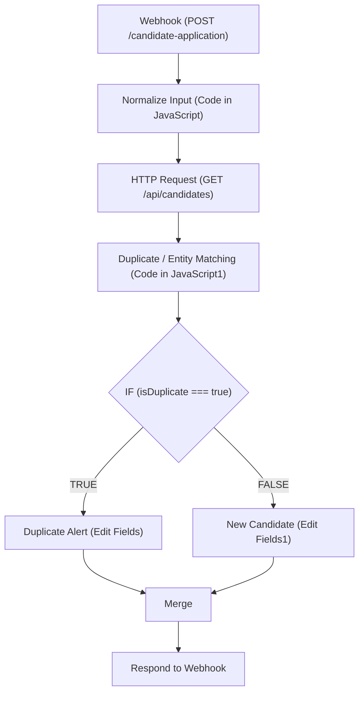

# Task 2 — n8n Candidate Duplicate Detection & Alert Workflow

Documentation for the verified Task 2 n8n workflow for candidate application duplicate detection and alert generation.

## Workflow Logical Flow



## Node Specifications & Descriptions

| Node Name | Node Type | Purpose / Functionality |
| :--- | :--- | :--- |
| **Webhook** | `n8n-nodes-base.webhook` | Trigger node listening for POST HTTP requests on `/candidate-application`. |
| **Normalize Input** | `n8n-nodes-base.code` | Cleans phone numbers, normalizes emails, formats names, and prepares standard candidate attributes. |
| **HTTP Request** | `n8n-nodes-base.httpRequest` | Fetches existing candidate database records from `GET http://127.0.0.1:8000/api/candidates`. |
| **Duplicate / Entity Matching** | `n8n-nodes-base.code` | Receives normalized input and database candidate array; executes exact email and phone matching logic. |
| **IF** | `n8n-nodes-base.if` | Evaluates condition `isDuplicate === true` to route workflow path. |
| **Duplicate Alert** | `n8n-nodes-base.set` | **TRUE Branch**: Sets `alert_type = "DUPLICATE_FOUND_ALERT"`, links matched Golden Entity ID (e.g. `PER_011`), and sets merge action. |
| **New Candidate** | `n8n-nodes-base.set` | **FALSE Branch**: Sets `alert_type = "NEW_CANDIDATE_RECORD"`, confirms candidate uniqueness, and sets ingestion action. |
| **Merge** | `n8n-nodes-base.merge` | Merges output from active branch (TRUE or FALSE) back into a single pipeline. |
| **Respond to Webhook** | `n8n-nodes-base.respondToWebhook` | Returns final JSON payload back to the webhook caller with HTTP status 200. |

---

## Verified Test Cases

### 1. Duplicate Candidate Test Case (`Tanvi Gupta`)

**Incoming Payload**:
```json
{
  "full_name": "Tanvi Gupta",
  "email": "tanvi.gupta31@example.com",
  "phone": "9000000254",
  "city": "Bengaluru",
  "skills": ["n8n", "LangChain", "REST APIs", "Python"],
  "experience_years": 4.2
}
```

**HTTP 200 Response Output**:
```json
{
  "alert_type": "DUPLICATE_FOUND_ALERT",
  "alert_message": "⚠️ DUPLICATE ALERT: Candidate Tanvi Gupta already exists in database as Golden Entity PER_011 (Tanvi Gupta) via Exact Email Match (tanvi.gupta31@example.com).",
  "action_required": "Merge source details into existing record PER_011"
}
```

### 2. New Candidate Test Case (`Rohan Sharma`)

**Incoming Payload**:
```json
{
  "full_name": "Rohan Sharma",
  "email": "rohan.sharma999@unique-domain-test.com",
  "phone": "9999999999",
  "city": "Mumbai",
  "skills": ["Python", "FastAPI"],
  "experience_years": 3.0
}
```

**HTTP 200 Response Output**:
```json
{
  "alert_type": "NEW_CANDIDATE_RECORD",
  "alert_message": "✅ NEW CANDIDATE: Candidate Rohan Sharma (rohan.sharma999@unique-domain-test.com) is unique and ready for ingestion.",
  "action_required": "Create new Golden Person profile"
}
```
